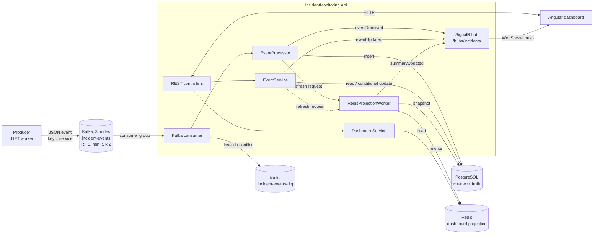

# Real-Time Incident Monitoring Dashboard

A small real-time monitoring system:
- A **producer** publishes operational events to a 3-node **Kafka** cluster.
- A **.NET 8** backend consumes and validates them.
- The backend stores them in **PostgreSQL**, the source of truth, and keeps a dashboard projection in **Redis** that is rebuilt from PostgreSQL. It exposes a **REST API**.
- Changes are pushed to the **Angular** dashboard over **SignalR**.

The Angular dashboard is in [`frontend/`](frontend/README.md). [docs/FRONTEND_INTEGRATION.md](docs/FRONTEND_INTEGRATION.md) describes the API contract it uses.

---

## 1. Architecture



### What happens to one event

```
Kafka message
  → deserialize and validate      (invalid → dead-letter topic)
  → insert into PostgreSQL        (same eventId and same content → duplicate, ignored;
                                   same eventId, different content → conflict → dead-letter topic)
  → request a dashboard refresh   (only sets a flag in memory; Redis is not called here)
  → push eventReceived over SignalR
  → commit the Kafka offset
```

Separately, the projection worker rebuilds the Redis dashboard from PostgreSQL and then pushes `summaryUpdated`.

This flow is implemented in [`EventProcessor.ProcessAsync`](backend/IncidentMonitoring.Core/Services/EventProcessor.cs), which [`KafkaConsumerService`](backend/IncidentMonitoring.Infrastructure/Kafka/KafkaConsumerService.cs) calls for each message.

### Why three data technologies?

| Technology | Role | Why |
|---|---|---|
| **Kafka** | Asynchronous event ingestion | Producers never wait for the backend. Events are buffered if the backend is slow or down. Three replicas keep acknowledged events when one broker fails. Messages that cannot be processed are set aside in a dead-letter topic. |
| **PostgreSQL** | Durable event history, the source of truth | Every valid event is stored permanently. It serves the event list with filtering, search and paging, event details, recent events and status updates. Its primary key on `eventId` prevents duplicates. |
| **Redis** | Dashboard projection | The dashboard numbers are precomputed from PostgreSQL and stored in a few keys, so the dashboard does not aggregate the whole events table on every request. Redis can always be rebuilt from PostgreSQL. |

### Projects

| Project | Contents |
|---|---|
| `IncidentMonitoring.Api` | Controllers, SignalR hub and notifier, global exception handler, `Program.cs` (startup and DI) |
| `IncidentMonitoring.Core` | Models, enums, DTOs, interfaces, business services (`EventProcessor`, `EventService`, `DashboardService`), rules (validation, duplicate comparison, status changes, service health, dashboard projection) |
| `IncidentMonitoring.Infrastructure` | EF Core `AppDbContext` and `EventRepository`, `RedisDashboardStore`, `RedisProjectionWorker`, `KafkaConsumerService`, health checks |
| `IncidentMonitoring.Producer` | Standalone worker that publishes random events |
| `IncidentMonitoring.Tests` | xUnit tests |

Core has no dependency on PostgreSQL, Redis, Kafka or SignalR. It only defines four small interfaces (`IEventRepository`, `IDashboardStore`, `IDashboardRefresher`, `IEventNotifier`), which is what makes the business logic unit-testable.

---

## 2. Technology choices

| Area | Choice |
|---|---|
| Backend | .NET 8 Web API |
| Messaging | Apache Kafka 3.9, 3 nodes in KRaft mode (no ZooKeeper), Confluent.Kafka client |
| Persistence | PostgreSQL 16 with EF Core 8 (Npgsql) and migrations |
| Dashboard projection | Redis 7 with StackExchange.Redis |
| Real-time | ASP.NET Core SignalR |
| Frontend | Angular 21 ([frontend/README.md](frontend/README.md)) |
| API docs | Swagger / OpenAPI (Swashbuckle) |
| Logging | Built-in .NET logging, JSON console output in Docker |
| Tests | xUnit |
| Runtime | Docker Compose |

---

## 3. How to run

Requirements: Docker Desktop.

```bash
docker compose up -d --build
```

| URL | What |
|---|---|
| http://localhost:8080/swagger | API documentation, where every endpoint can be tried |
| http://localhost:8080/health | Health check (PostgreSQL, Redis, Kafka) |
| http://localhost:8081 | Kafka UI: topics, messages, consumer group, dead-letter topic |

The Angular dashboard runs separately with `npm start` in `frontend/` and opens on http://localhost:4200. See [frontend/README.md](frontend/README.md).

Docker services:

| Service | Purpose |
|---|---|
| `kafka-1`, `kafka-2`, `kafka-3` | Kafka nodes, each both broker and controller (KRaft) |
| `kafka-init` | Waits until all three brokers are registered, creates the two topics, then exits |
| `kafka-ui` | Web UI for Kafka |
| `redis` | Dashboard projection (append-only file enabled) |
| `postgres` | Event storage |
| `api` | REST API, SignalR hub, Kafka consumer and Redis projection worker |
| `producer` | Publishes one random event every 2 seconds |

The API creates the database schema on startup (EF Core migrations). Events start arriving a few seconds after startup.

Useful commands:

```bash
docker compose logs -f api                 # consumer and API logs (JSON)
docker compose stop producer               # pause the event stream
docker compose run --rm -e Producer__Count=20 -e Producer__IntervalMs=100 producer   # manual run: send 20 events and exit
docker compose down -v                     # stop everything and delete all data
```

### Running the backend without Docker

```bash
docker compose up -d kafka-1 kafka-2 kafka-3 kafka-init redis postgres
cd backend
dotnet run --project IncidentMonitoring.Api         # http://localhost:8080
dotnet run --project IncidentMonitoring.Producer    # in a second terminal
```

`appsettings.json` points to `localhost` (Kafka on `localhost:29092,localhost:29093,localhost:29094`). In Docker the same settings are overridden with environment variables (`Kafka__BootstrapServers=kafka-1:9092,kafka-2:9092,kafka-3:9092`, and so on).

---

## 4. Kafka design

### Cluster

Three nodes, `kafka-1` to `kafka-3`, each acting as both broker and controller (combined KRaft mode), with one fixed cluster id. Every node keeps its data in its own named volume.

| Setting | Value | Why |
|---|---|---|
| Replication factor | 3 | Every partition has a copy on every node |
| `min.insync.replicas` | 2 | A write with `acks=all` is confirmed only once 2 nodes have it, so one node can fail without losing confirmed events. With two nodes down, writes are refused instead of being accepted unsafely. |
| Consumer offsets topic | replication factor 3 | Committed offsets survive the loss of one node |
| Unclean leader election | disabled | A replica that is behind never becomes leader and silently drops confirmed messages |

Containers use `kafka-N:9092`; programs on the host use `localhost:29092`, `29093` and `29094`.

### Topics

| Topic | Partitions | Replication | Purpose |
|---|---|---|---|
| `incident-events` | 3 | RF 3, min ISR 2 | Incoming events |
| `incident-events-dlq` | 1 | RF 3, min ISR 2 | Messages that could not be processed |

The topics are created by the `kafka-init` container. The dead-letter topic is as durable as the main topic because the main offset is committed only after the dead-letter write is confirmed.

**Producer**
- The message **key is the service name**, so all events of one service go to the same partition and are consumed in order.
- `acks=all` and idempotence are enabled.
- Event ids are `EVT-` followed by a random UUID (32 uppercase hex digits). Timestamps are UTC with milliseconds.
- The interval is configurable (`Producer__IntervalMs`). `Producer__Count` sends a fixed number of events and exits, for manual runs. On stop it logs how many events were attempted and how many were published.

**Consumer** (`KafkaConsumerService`)
- **Consumer group** `incident-monitoring-api`. Every API instance joins it, and Kafka splits the 3 partitions between them, so each message is processed by one instance.
- **Manual offset commit** (`EnableAutoCommit=false`). The offset is committed only after a message has a final outcome: stored, ignored as a duplicate, or confirmed in the dead-letter topic. If the API stops in the middle, the message is delivered again. Duplicates are then recognised in PostgreSQL, so nothing is lost or counted twice.
- A new consumer group starts from the beginning of the topic (`AutoOffsetReset=Earliest`).

### Retry and dead-letter topic

| Situation | Behaviour |
|---|---|
| Invalid message (bad JSON, missing field, unknown severity or status, timestamp without a time zone or more than 5 minutes in the future, unsafe characters in `eventId`) | Sent to `incident-events-dlq` immediately. Retrying cannot fix it. |
| Same `eventId` and same content (source, service, severity, message, timestamp) | Duplicate: logged and ignored. A different status in the message does not overwrite the stored status. |
| Same `eventId`, different content | Conflict: the stored event is kept and the message is sent to `incident-events-dlq`. |
| PostgreSQL temporarily unavailable | Nothing is committed and nothing goes to the dead-letter topic. The consumer seeks back to the same offset and reads it again after 1 s, 2 s, 4 s … up to 30 s, for as long as the outage lasts. |
| Any other processing error | Retried up to `MaxAttempts` = 3 times with waits of 1 s and 2 s, then sent to `incident-events-dlq`. |
| Kafka offset commit fails | Logged. The message may be delivered again, which is then handled as a duplicate. |

A dead-lettered message keeps its original key and value. These headers are added:
- `error`
- `original-topic`
- `original-partition`
- `original-offset`

You can view dead-lettered messages in Kafka UI.

---

## 5. Redis dashboard projection

Redis holds only numbers derived from PostgreSQL. `EventProcessor` and `EventService` never write to Redis; they only request a refresh. A single `RedisProjectionWorker` (a background service in the API) is the only writer.

**Rebuild:** the worker reads one consistent snapshot from PostgreSQL (a read-only `REPEATABLE READ` transaction with grouped counts and the latest event per service), computes the whole dashboard in memory, and writes it to Redis in one `MULTI/EXEC` with absolute values. Services that no longer exist are deleted. A rebuild can therefore be repeated at any time and always gives the same result.

**When a rebuild runs:**
- at startup
- after a new event is stored or a status is changed. Refresh requests close together are combined into one rebuild.
- every 30 seconds (`DashboardProjection:RefreshIntervalSeconds`), as a safety net
- when Redis reconnects after an outage

A failed rebuild is retried after 1 s, 2 s, 4 s … up to 30 s. New refresh requests do not shorten this wait, so a steady event stream during a Redis outage does not cause a busy loop. A Redis reconnect does shorten it.

| Key | Type | Content |
|---|---|---|
| `dashboard:total` | string | Total number of events |
| `dashboard:critical` | string | CRITICAL events that are not RESOLVED |
| `dashboard:snapshotAt` | string | PostgreSQL time of the snapshot the projection was built from |
| `severity:{SEVERITY}:count` | string | Events per severity, all statuses, e.g. `severity:CRITICAL:count` |
| `status:{STATUS}:count` | string | Events per status, e.g. `status:OPEN:count` |
| `services` | set | Names of all services with events |
| `service:{service}:status` | hash | `lastEventTime`, `latestSeverity` (latest event by timestamp, then `eventId`), and `open:{SEVERITY}` (incidents per severity that are not RESOLVED) |

Every counter is written on every rebuild, zeros included, so no value from an older projection survives.

**Persistence:** Redis runs with the append-only file enabled and `noeviction`. It does not have to survive a restart, though: anything missing is rebuilt from PostgreSQL.

**Redis unavailable:** the API does not wait for Redis. Commands fail at once (`BacklogPolicy.FailFast`), the dashboard and services endpoints return `503`, and the worker retries until Redis is back.

---

## 6. PostgreSQL

One table, `events`, created by an EF Core migration ([`Data/Migrations`](backend/IncidentMonitoring.Infrastructure/Data/Migrations)).

| Column | Notes |
|---|---|
| `EventId` | Primary key, which **prevents duplicate events** |
| `Source`, `Service`, `Message` | Text |
| `Severity`, `Status` | Stored as text (`CRITICAL`, `OPEN`) |
| `Timestamp` | Event time (UTC, microsecond precision) |
| `ReceivedAt` | When the backend consumed the event |
| `StatusUpdatedAt` | Last status change through the API |

Indexes cover the default sort (`Timestamp`) and each list filter (`Severity`, `Status`, `Source`, `Service`).

PostgreSQL serves the event list, filtering, search, event details, recent events, the filter values, status updates, and the snapshot the Redis projection is built from.

**Concurrent status updates** use one conditional `UPDATE … WHERE EventId = @id AND Status = @expectedStatus`. If two requests change the same event at once, only one of them matches the row.

---

## 7. REST API

Base URL `http://localhost:8080`. Full, interactive documentation is available in Swagger. Request and response examples are in [docs/FRONTEND_INTEGRATION.md](docs/FRONTEND_INTEGRATION.md).

| Method | Endpoint | Description | Data from |
|---|---|---|---|
| GET | `/api/events` | Event list. Filters: `severity`, `status`, `source`, `service`, `search`. Paging: `page`, `pageSize` (max 100). Newest first. | PostgreSQL |
| GET | `/api/events/{eventId}` | One event | PostgreSQL |
| PUT | `/api/events/{eventId}/status` | Change status, body `{"status":"RESOLVED"}` | PostgreSQL |
| GET | `/api/events/recent?count=10` | Latest events (1-50), ordered by `timestamp` then `eventId`, newest first | PostgreSQL |
| GET | `/api/events/facets` | Sources and services seen, plus all severities and statuses (for filter drop-downs) | PostgreSQL |
| GET | `/api/dashboard/summary` | Totals, distributions, service statuses, `snapshotAt` | Redis |
| GET | `/api/services` | Status per service | Redis |
| GET | `/health` | `Healthy` / `Unhealthy` | — |

Example: `GET /api/events?severity=CRITICAL&status=OPEN&source=ATS&search=route&page=1&pageSize=20`

### Status changes

| From | Allowed to |
|---|---|
| OPEN | ACKNOWLEDGED, RESOLVED |
| ACKNOWLEDGED | RESOLVED |
| RESOLVED | OPEN (reopen) |

Any other change returns `409 Conflict`. The rule is in [`StatusRules`](backend/IncidentMonitoring.Core/Rules/StatusRules.cs). Requesting the current status returns `200` and changes nothing.

A status update:
1. updates PostgreSQL with the conditional `UPDATE` described above
2. requests a dashboard refresh
3. pushes `eventUpdated` over SignalR

If another request changed the status first, the losing request returns `200` when the event already has the requested status, and `409` otherwise. Only the request that changed the row requests a refresh and sends `eventUpdated`.

### Service health

A service's status is derived from its **open incidents**, meaning its incidents that are not RESOLVED. The rule is in [`ServiceHealthRule`](backend/IncidentMonitoring.Core/Rules/ServiceHealthRule.cs):

| Worst open incident | Service status |
|---|---|
| CRITICAL | `DOWN` |
| MAJOR | `DEGRADED` |
| WARNING | `WARNING` |
| none, or only INFO | `HEALTHY` |

---

## 8. SignalR

Hub URL: `http://localhost:8080/hubs/incidents`. The server only pushes messages; clients do not call any hub methods.

| Message | Payload | Sent when |
|---|---|---|
| `eventReceived` | event (same JSON as the REST API) | A new event was stored in PostgreSQL |
| `eventUpdated` | event | An event's status was changed in PostgreSQL |
| `summaryUpdated` | dashboard summary (same JSON as `/api/dashboard/summary`) | The projection worker has written a new projection to Redis |

`summaryUpdated` contains exactly the projection that was just written. Several events can be combined into one summary, and it can arrive before or after the event message that caused it. While Redis is unavailable no summary is sent.

CORS allows `http://localhost:4200` with credentials, as the SignalR JavaScript client requires.

### How Angular should connect

```ts
import * as signalR from '@microsoft/signalr';

const connection = new signalR.HubConnectionBuilder()
  .withUrl('http://localhost:8080/hubs/incidents')
  .withAutomaticReconnect()
  .build();

connection.on('eventReceived', event => { /* add to lists */ });
connection.on('eventUpdated', event => { /* replace in lists */ });
connection.on('summaryUpdated', summary => { /* update cards and charts */ });
connection.onreconnected(() => { /* reload data over REST: messages sent while offline are not replayed */ });

await connection.start();
```

Details: [docs/FRONTEND_INTEGRATION.md](docs/FRONTEND_INTEGRATION.md).

---

## 9. Error handling

All errors are returned as ProblemDetails (`application/problem+json`):

| Status | When |
|---|---|
| 400 | Invalid query parameter or request body, e.g. unknown severity, `pageSize` > 100, missing status. Produced by ASP.NET Core model validation. |
| 404 | Event not found |
| 409 | Status change not allowed, or lost to a concurrent change |
| 503 | PostgreSQL temporarily unavailable, for the endpoints that use it; Redis unavailable, for the dashboard and services endpoints |
| 500 | Unexpected error. No internal details are returned; the exception is logged. |

The mapping from exception to status code is in one place: [`GlobalExceptionHandler`](backend/IncidentMonitoring.Api/Middleware/GlobalExceptionHandler.cs). The same rule, [`TransientFailure`](backend/IncidentMonitoring.Infrastructure/TransientFailure.cs), decides both when the API returns `503` for the database and when the Kafka consumer waits instead of dead-lettering a message.

## 10. Logging

The backend uses built-in .NET logging with message templates, so values such as `EventId`, `Partition` and `Offset` are separate fields. In Docker the console output is JSON (`Logging__Console__FormatterName=json`).

The following are logged:
- Kafka message received
- Event processed
- Duplicate ignored, and a warning when a redelivered event has a different status than the stored one
- Invalid message and eventId conflict
- PostgreSQL unavailable, with the retry delay
- Retry attempt and DLQ publication
- Kafka commit failure
- Status change
- Dashboard projection rebuild failure and recovery
- Unexpected API errors

---

## 11. Testing

```bash
cd backend
dotnet test
```

144 tests. PostgreSQL, Redis and SignalR are replaced by small in-memory fakes ([`Fakes.cs`](backend/IncidentMonitoring.Tests/Fakes.cs)).

| Test class | What it covers |
|---|---|
| `EventValidatorTests` | Required fields, lengths, eventId characters, severity and status values, strict ISO-8601 timestamps with a time zone, future-timestamp limit |
| `EventComparisonTests` | Which fields decide duplicate vs conflict; status, `ReceivedAt` and `StatusUpdatedAt` are ignored; microsecond precision |
| `EventProcessorTests` | A valid event is stored, a refresh is requested and `eventReceived` is sent once. Invalid, duplicate, conflict and status-different messages change nothing and send nothing. A database error is thrown to the consumer. |
| `EventServiceTests` | Status updates: winner, same-status no-op, 404, invalid transition, and lost concurrent updates. Recent events ordering. |
| `RulesTests` | Allowed and forbidden status changes, service health rule |
| `DashboardProjectionTests` | Dashboard numbers built from a PostgreSQL snapshot (open, unresolved critical, per-service counts, latest event) |
| `DashboardServiceTests` | Summary read from Redis, and the summary built from a new projection |
| `RedisProjectionWorkerTests` | Startup, periodic and requested rebuilds; coalescing; retry after a failure; reconnect shortening the retry wait; `summaryUpdated` only after a successful write |
| `RefreshSignalTests` | The dirty flag and wake-up that coalesce refresh requests |
| `TransientFailureTests` | Which exceptions count as a temporary PostgreSQL outage (including the shapes seen when the database container stops), and that Redis and Kafka errors do not |
| `RetryBackoffTests`, `TimePrecisionTests`, `EventGeneratorTests` | Backoff sequence, microsecond truncation, generated event format |

There are no automated integration tests. The following were verified manually against the running Docker environment:
- the end-to-end flow, with PostgreSQL, Redis and REST agreeing
- two concurrent status updates on the same event: one wins, the other gets `409`
- duplicate, conflict, invalid and malformed messages, and the dead-letter topic
- Redis stopped and restarted: events and status changes are still stored, and the dashboard is rebuilt automatically
- PostgreSQL stopped and restarted: the consumer waits on the same offsets without dead-lettering, then stores every event once
- the 3-node Kafka cluster: quorum, replication and topic settings
- SignalR messages, observed with a long-polling client

A minimal GitHub Actions workflow ([.github/workflows/ci.yml](.github/workflows/ci.yml)) builds the solution, runs the tests and validates `docker-compose.yml`.

---

## 12. Assumptions

- **Open events** (`openEvents` in the summary) are events with status `OPEN`. A service's **open incident count** includes `OPEN` and `ACKNOWLEDGED`, i.e. everything not resolved, because an acknowledged incident still affects the service.
- **Critical events** (`criticalEvents`) are CRITICAL events that are not RESOLVED. `severityDistribution.CRITICAL` counts all CRITICAL events, so it can be higher.
- **Incoming status:** events can arrive with any status. Later changes are made through the API; a redelivered message never overwrites them.
- **Latest event of a service:** the event with the latest `timestamp`, with `eventId` as tie-breaker.
- **Duplicates:** the first event with a given `eventId` is kept. A later message with the same id and the same content is ignored; one with different content is a conflict and goes to the dead-letter topic.
- **Timestamps** are stored and returned in UTC, with microsecond precision (as in PostgreSQL). Late events are accepted; timestamps more than 5 minutes in the future are rejected.

## 13. Design decisions

- **PostgreSQL is the source of truth, Redis is derived from it.** Everything is written to PostgreSQL first. Redis only holds dashboard numbers, which can always be rebuilt.
- **Full rebuild instead of counter updates.** Updating Redis counters on every event cannot be repaired after a missed update; recomputing everything from PostgreSQL can. At this data volume a rebuild is cheap, and combining refresh requests keeps it to one rebuild per burst.
- **One Redis writer.** Only the projection worker writes to Redis, so there are no competing updates.
- **Duplicates are stopped by the PostgreSQL primary key.** A redelivered message is compared with the stored row, so a duplicate is never stored or counted twice. No extra idempotency mechanism was needed.
- **At-least-once processing.** The Kafka offset is committed only after a final outcome. A PostgreSQL outage is not treated as a bad message: the consumer waits and reads the same offset again.
- **Consumer and projection worker inside the API process.** This keeps the deployment simple (one backend container). Both are `BackgroundService`s.
- **UPPERCASE enum names** (`CRITICAL`, `OPEN`). They are exactly the schema values, so the same text is used in Kafka, JSON, Redis keys and the database without any mapping.
- **Few abstractions.** There are four small interfaces, one per external dependency the business logic needs, to make it testable. There is no CQRS, no MediatR and no generic repository.

## 14. Known limitations

- **PostgreSQL is a single local instance.** While it is unavailable, database endpoints return `503` and the consumer waits.
- **Redis is a single local instance.** While it is unavailable, events and status changes are still stored, but the dashboard and services endpoints return `503` until Redis is back and the projection is rebuilt.
- **One consumer loop.** The consumer handles one message at a time, so a PostgreSQL outage pauses progress on all its partitions, not only the one with the failing message.
- **Very long outages and consumer group timing.** The consumer keeps polling Kafka between retries, but a write to the dead-letter topic can wait up to Kafka's delivery timeout (300 s by default). If that ever came close to `max.poll.interval.ms`, the consumer could be removed from the group, and the message would be processed again after a restart. It is never lost.
- **Dead-letter write failure:** if the dead-letter topic cannot be written, the consumer stops. Docker restarts the API, and the message, whose offset was not committed, is processed again.
- **Dashboard REST reads are not one snapshot.** `/api/dashboard/summary` reads several Redis keys one after another, so a read during a rebuild can mix two consecutive projections. `summaryUpdated` always contains one complete projection.
- **The Kafka setup is for local development.** Three combined broker/controller nodes on one machine are enough to show replication and failover, not a production deployment.
- **No authentication or authorization.** Anyone who can reach the API can change statuses.
- **Search uses `ILIKE`.** This is fine for this data volume. Large tables would need a full-text or trigram index.
- **No DLQ replay tool.** Dead-lettered messages can be inspected in Kafka UI, but they are not re-processed automatically.

## 15. Screenshots

_To be added._
