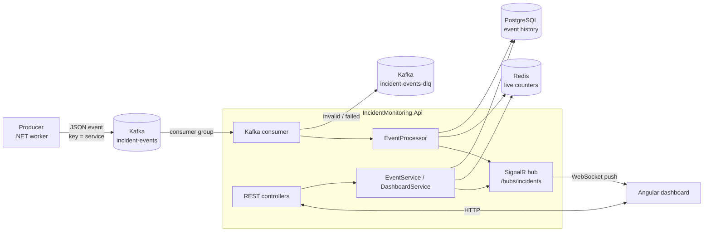

# Real-Time Incident Monitoring Dashboard

A small real-time monitoring system:
- A **producer** publishes operational events to **Kafka**.
- A **.NET 8** backend consumes and validates them.
- The backend stores them in **PostgreSQL**, keeps live dashboard state in **Redis**, and exposes a **REST API**.
- Changes are pushed to the dashboard over **SignalR**.

The Angular dashboard is a separate part of the project. [docs/FRONTEND_INTEGRATION.md](docs/FRONTEND_INTEGRATION.md) describes the API contract it uses.

---

## 1. Architecture



### What happens to one event

```
Kafka message
  → deserialize JSON
  → validate            (invalid → dead-letter topic)
  → store in PostgreSQL (duplicate eventId → ignored)
  → update Redis counters and service state
  → push eventReceived + summaryUpdated over SignalR
  → commit the Kafka offset
```

This flow is implemented in [`EventProcessor.ProcessAsync`](backend/IncidentMonitoring.Core/Services/EventProcessor.cs), which [`KafkaConsumerService`](backend/IncidentMonitoring.Infrastructure/Kafka/KafkaConsumerService.cs) calls for each message.

### Why three data technologies?

| Technology | Role | Why |
|---|---|---|
| **Kafka** | Asynchronous event ingestion | Producers never wait for the backend. Events are buffered if the backend is slow or down. A consumer group lets several backend instances share the work. Failed messages are set aside in a dead-letter topic. |
| **PostgreSQL** | Durable event history | Every valid event is stored permanently. It supports the event list with filtering, search and paging, event details and status updates. Its primary key on `eventId` prevents duplicates. |
| **Redis** | Fast live dashboard state | Counters and per-service state are updated on each event, so the dashboard reads a handful of keys instead of aggregating the whole events table on every refresh. |

### Projects

| Project | Contents |
|---|---|
| `IncidentMonitoring.Api` | Controllers, SignalR hub and notifier, global exception handler, `Program.cs` (startup and DI) |
| `IncidentMonitoring.Core` | Models, enums, DTOs, interfaces, business services (`EventProcessor`, `EventService`, `DashboardService`), rules (validation, status changes, service health) |
| `IncidentMonitoring.Infrastructure` | EF Core `AppDbContext` and `EventRepository`, `RedisDashboardStore`, `KafkaConsumerService`, health checks |
| `IncidentMonitoring.Producer` | Standalone worker that publishes random events |
| `IncidentMonitoring.Tests` | xUnit tests for Core |

Core has no dependency on PostgreSQL, Redis, Kafka or SignalR. It only defines three interfaces (`IEventRepository`, `IDashboardStore`, `IEventNotifier`), which is what makes the business logic unit-testable.

---

## 2. Technology choices

| Area | Choice |
|---|---|
| Backend | .NET 8 Web API |
| Messaging | Apache Kafka 3.9 (KRaft mode, no ZooKeeper), Confluent.Kafka client |
| Persistence | PostgreSQL 16 with EF Core 8 (Npgsql) and migrations |
| Live state | Redis 7 with StackExchange.Redis |
| Real-time | ASP.NET Core SignalR |
| API docs | Swagger / OpenAPI (Swashbuckle) |
| Logging | Built-in .NET logging, JSON console output in Docker |
| Tests | xUnit |
| Runtime | Docker Compose |

---

## 3. How to run

Requirements: Docker Desktop.

```bash
docker compose up -d --build
```

| URL | What |
|---|---|
| http://localhost:8080/swagger | API documentation, where every endpoint can be tried |
| http://localhost:8080/health | Health check (PostgreSQL, Redis, Kafka) |
| http://localhost:8081 | Kafka UI: topics, messages, consumer group, dead-letter topic |

Docker services:

| Service | Purpose |
|---|---|
| `kafka` | Kafka broker in KRaft mode |
| `kafka-init` | Creates the two topics, then exits |
| `kafka-ui` | Web UI for Kafka |
| `redis` | Live dashboard state (append-only file enabled) |
| `postgres` | Event storage |
| `api` | REST API, SignalR hub and Kafka consumer |
| `producer` | Publishes one random event every 2 seconds |

The API creates the database schema on startup (EF Core migrations). Events start arriving a few seconds after startup.

Useful commands:

```bash
docker compose logs -f api                 # consumer and API logs (JSON)
docker compose stop producer               # pause the event stream
docker compose run --rm -e Producer__Count=20 -e Producer__IntervalMs=100 producer   # manual run: send 20 events and exit
docker compose down -v                     # stop everything and delete all data
```

### Running the backend without Docker

```bash
docker compose up -d kafka kafka-init redis postgres
cd backend
dotnet run --project IncidentMonitoring.Api         # http://localhost:8080
dotnet run --project IncidentMonitoring.Producer    # in a second terminal
```

`appsettings.json` points to `localhost`. In Docker the same settings are overridden with environment variables (`Kafka__BootstrapServers=kafka:9092`, and so on).

---

## 4. Kafka design

| Topic | Partitions | Purpose |
|---|---|---|
| `incident-events` | 3 | Incoming events |
| `incident-events-dlq` | 1 | Messages that could not be processed |

The topics are created by the `kafka-init` container.

**Producer**
- The message **key is the service name**, so all events of one service go to the same partition and are consumed in order.
- `acks=all` and idempotence are enabled.
- The interval is configurable (`Producer__IntervalMs`). `Producer__Count` sends a fixed number of events and exits, for manual runs.

**Consumer** (`KafkaConsumerService`)
- **Consumer group** `incident-monitoring-api`. Every API instance joins it, and Kafka splits the 3 partitions between them, so each message is processed by one instance.
- **Manual offset commit** (`EnableAutoCommit=false`). The offset is committed only after a message has been fully handled: processed, ignored as a duplicate, or sent to the DLQ. If the API stops in the middle, the message is delivered again, so nothing is lost.
- A new consumer group starts from the beginning of the topic (`AutoOffsetReset=Earliest`).

### Retry and dead-letter topic

| Situation | Behaviour |
|---|---|
| Invalid message (bad JSON, missing field, unknown severity or status, bad timestamp) | Sent to `incident-events-dlq` immediately. Retrying cannot fix it. |
| Processing error (e.g. PostgreSQL unavailable) | Retried up to `MaxAttempts` = 3 times with waits of 1 s and 2 s. Then sent to `incident-events-dlq`. |
| Duplicate `eventId` | Logged and ignored. |

A dead-lettered message keeps its original key and value. These headers are added:
- `error`
- `original-topic`
- `original-partition`
- `original-offset`

You can view dead-lettered messages in Kafka UI.

---

## 5. Redis key design

| Key | Type | Content |
|---|---|---|
| `dashboard:total` | string | Total number of events |
| `severity:{SEVERITY}:count` | string | Events per severity, e.g. `severity:CRITICAL:count` |
| `status:{STATUS}:count` | string | Events per status, e.g. `status:OPEN:count` |
| `services` | set | Names of all services seen so far |
| `service:{service}:status` | hash | `lastEventTime`, `latestSeverity`, and `open:{SEVERITY}` (number of open incidents per severity) |
| `recent:events` | list | Ids of the 50 latest events, newest first |

**New event:** in one Redis transaction (`MULTI/EXEC`), the backend:
1. increments `dashboard:total`, the severity counter and the status counter
2. sets `lastEventTime` and `latestSeverity` of the service
3. increments `open:{SEVERITY}` if the event is not RESOLVED
4. pushes the id onto `recent:events` and trims the list to 50

**Status change**, e.g. OPEN → RESOLVED: in one transaction, the backend decrements `status:OPEN:count` and increments `status:RESOLVED:count`. If the incident became resolved, it decrements the service's `open:{SEVERITY}`. If it was reopened, it increments it.

**Cleanup:** `recent:events` is capped with `LTRIM`. All other keys are small, fixed-size counters, one per severity, status or service, so they need no expiry.

**Persistence:** Redis runs with the append-only file enabled (`--appendonly yes` and a volume), so counters survive a Redis restart.

---

## 6. PostgreSQL

One table, `events`, created by an EF Core migration ([`Data/Migrations`](backend/IncidentMonitoring.Infrastructure/Data/Migrations)).

| Column | Notes |
|---|---|
| `EventId` | Primary key, which **prevents duplicate events** |
| `Source`, `Service`, `Message` | Text |
| `Severity`, `Status` | Stored as text (`CRITICAL`, `OPEN`) |
| `Timestamp` | Event time (UTC) |
| `ReceivedAt` | When the backend consumed the event |
| `StatusUpdatedAt` | Last status change through the API |

Indexes cover the default sort (`Timestamp`) and each list filter (`Severity`, `Status`, `Source`, `Service`).

PostgreSQL serves the event list, filtering, search, event details, the recent events' details, the filter values, and status updates.

---

## 7. REST API

Base URL `http://localhost:8080`. Full, interactive documentation is available in Swagger. Request and response examples are in [docs/FRONTEND_INTEGRATION.md](docs/FRONTEND_INTEGRATION.md).

| Method | Endpoint | Description | Data from |
|---|---|---|---|
| GET | `/api/events` | Event list. Filters: `severity`, `status`, `source`, `service`, `search`. Paging: `page`, `pageSize` (max 100). Newest first. | PostgreSQL |
| GET | `/api/events/{eventId}` | One event | PostgreSQL |
| PUT | `/api/events/{eventId}/status` | Change status, body `{"status":"RESOLVED"}` | PostgreSQL, then Redis |
| GET | `/api/events/recent?count=10` | Latest events (1-50) | Redis ids + PostgreSQL |
| GET | `/api/events/facets` | Sources and services seen, plus all severities and statuses (for filter drop-downs) | PostgreSQL |
| GET | `/api/dashboard/summary` | Totals, distributions, service statuses | Redis |
| GET | `/api/services` | Status per service | Redis |
| GET | `/health` | `Healthy` / `Unhealthy` | — |

Example: `GET /api/events?severity=CRITICAL&status=OPEN&source=ATS&search=route&page=1&pageSize=20`

### Status changes

| From | Allowed to |
|---|---|
| OPEN | ACKNOWLEDGED, RESOLVED |
| ACKNOWLEDGED | RESOLVED |
| RESOLVED | OPEN (reopen) |

Any other change returns `409 Conflict`. The rule is in [`StatusRules`](backend/IncidentMonitoring.Core/Rules/StatusRules.cs).

A status update:
1. updates PostgreSQL
2. moves the Redis counters
3. pushes `eventUpdated` and `summaryUpdated` over SignalR

### Service health

A service's status is derived from its **open incidents**, meaning its incidents that are not RESOLVED. The rule is in [`ServiceHealthRule`](backend/IncidentMonitoring.Core/Rules/ServiceHealthRule.cs):

| Worst open incident | Service status |
|---|---|
| CRITICAL | `DOWN` |
| MAJOR | `DEGRADED` |
| WARNING | `WARNING` |
| none, or only INFO | `HEALTHY` |

---

## 8. SignalR

Hub URL: `http://localhost:8080/hubs/incidents`. The server only pushes messages; clients do not call any hub methods.

| Message | Payload | Sent when |
|---|---|---|
| `eventReceived` | event (same JSON as the REST API) | A new event was consumed from Kafka |
| `eventUpdated` | event | An event's status was changed |
| `summaryUpdated` | dashboard summary (same JSON as `/api/dashboard/summary`) | After each of the above |

CORS allows `http://localhost:4200` with credentials, as the SignalR JavaScript client requires.

### How Angular should connect

```ts
import * as signalR from '@microsoft/signalr';

const connection = new signalR.HubConnectionBuilder()
  .withUrl('http://localhost:8080/hubs/incidents')
  .withAutomaticReconnect()
  .build();

connection.on('eventReceived', event => { /* add to lists */ });
connection.on('eventUpdated', event => { /* replace in lists */ });
connection.on('summaryUpdated', summary => { /* update cards and charts */ });
connection.onreconnected(() => { /* reload data over REST: messages sent while offline are not replayed */ });

await connection.start();
```

Details: [docs/FRONTEND_INTEGRATION.md](docs/FRONTEND_INTEGRATION.md).

---

## 9. Error handling

All errors are returned as ProblemDetails (`application/problem+json`):

| Status | When |
|---|---|
| 400 | Invalid query parameter or request body, e.g. unknown severity, `pageSize` > 100, missing status. Produced by ASP.NET Core model validation. |
| 404 | Event not found |
| 409 | Status change not allowed |
| 503 | Redis unavailable, for the dashboard and services endpoints |
| 500 | Unexpected error. No internal details are returned; the exception is logged. |

The mapping from exception to status code is in one place: [`GlobalExceptionHandler`](backend/IncidentMonitoring.Api/Middleware/GlobalExceptionHandler.cs).

## 10. Logging

The backend uses built-in .NET logging with message templates, so values such as `EventId`, `Partition` and `Offset` are separate fields. In Docker the console output is JSON (`Logging__Console__FormatterName=json`).

The following are logged:
- Kafka message received
- Event processed
- Duplicate ignored
- Invalid message
- Retry attempt
- DLQ publication
- Status change
- Redis failure
- Unexpected API errors

---

## 11. Testing

```bash
cd backend
dotnet test
```

16 test methods, 29 test cases including theory cases, all for Core. Infrastructure is replaced by small in-memory fakes ([`Fakes.cs`](backend/IncidentMonitoring.Tests/Fakes.cs)).

| Test class | What it covers |
|---|---|
| `EventValidatorTests` | Valid message, all missing fields reported, unknown severity/status, invalid timestamp |
| `RulesTests` | Allowed and forbidden status changes, service health rule |
| `EventProcessorTests` | Valid event is stored, counted and pushed. Invalid JSON and invalid fields are rejected. A duplicate does not update Redis twice. Redis down still stores the event. A database error is thrown so the consumer retries. |
| `EventServiceTests` | Status update order (database → Redis → SignalR), 404 for unknown event, invalid transition changes nothing |
| `DashboardServiceTests` | Summary and service health built from Redis state |

The following were verified manually against the running Docker environment:
- the end-to-end flow
- filters and search
- status update and Redis counters
- duplicate handling
- DLQ publication, for invalid messages and for retries with PostgreSQL stopped
- Redis outage (503)
- a SignalR client connection over WebSockets

A minimal GitHub Actions workflow ([.github/workflows/ci.yml](.github/workflows/ci.yml)) builds the solution, runs the tests and validates `docker-compose.yml`.

---

## 12. Assumptions

- **Open events** (`openEvents` in the summary) are events with status `OPEN`. A service's **open incident count** includes `OPEN` and `ACKNOWLEDGED`, i.e. everything not resolved, because an acknowledged incident still affects the service.
- **Critical events** (`criticalEvents`) is the total number of events with severity CRITICAL.
- **Incoming status:** events can arrive with any status. Later changes are made through the API.
- **Event order:** events are keyed by service, so they arrive in order per service. The latest event processed for a service is taken as its latest state.
- **Duplicates:** the first event with a given `eventId` is kept. Later messages with the same id are ignored.
- **Timestamps** are stored and returned in UTC.

## 13. Design decisions

- **PostgreSQL is the source of truth, Redis is derived from it.** The list, search and details are read from PostgreSQL. The dashboard numbers are read from Redis.
- **Duplicates are stopped by the PostgreSQL primary key.** Redis is only updated after a successful insert, so a duplicate can never increment the counters twice. No extra idempotency mechanism was needed.
- **Consumer inside the API process.** This keeps the deployment simple (one backend container) and matches the expected architecture. The consumer is a `BackgroundService`.
- **UPPERCASE enum names** (`CRITICAL`, `OPEN`). They are exactly the schema values, so the same text is used in Kafka, JSON, Redis keys and the database without any mapping.
- **Few abstractions.** There are three interfaces, one per external dependency the business logic needs, to make it testable. There is no CQRS, no MediatR and no generic repository.
- **SignalR sends the full summary after each change.** At the producer's rate this is cheap and keeps the client simple.

## 14. Known limitations

- **Redis failures are not repaired automatically.** If Redis is unavailable while an event is processed or a status is changed:
  - The change is saved in PostgreSQL, and the Redis error is logged.
  - The dashboard counters are then missing that change. There is no automatic rebuild of Redis from PostgreSQL.
  - While Redis is down, `/api/dashboard/summary`, `/api/services` and `/api/events/recent` return `503`. The event endpoints keep working.
  - Improvement: a command or startup job that recalculates the Redis keys from the `events` table.
- **Redis update is not in the same transaction as the PostgreSQL insert.** If the process crashed exactly between the two steps, the retried message would be treated as a duplicate and Redis would miss that event.
- **DLQ publication failure:** if the dead-letter topic cannot be written, the consumer stops. Docker restarts the API, and the message, whose offset was not committed, is processed again.
- **No authentication or authorization.** Anyone who can reach the API can change statuses.
- **Search uses `ILIKE`.** This is fine for this data volume. Large tables would need a full-text or trigram index.
- **SignalR with several API instances** would need the Redis backplane so every client receives every message.
- **No DLQ replay tool.** Dead-lettered messages can be inspected in Kafka UI, but they are not re-processed automatically.
- **No integration tests** with real Kafka, Redis and PostgreSQL containers. The end-to-end flow was verified manually.

## 15. Screenshots

_To be added together with the Angular dashboard._
